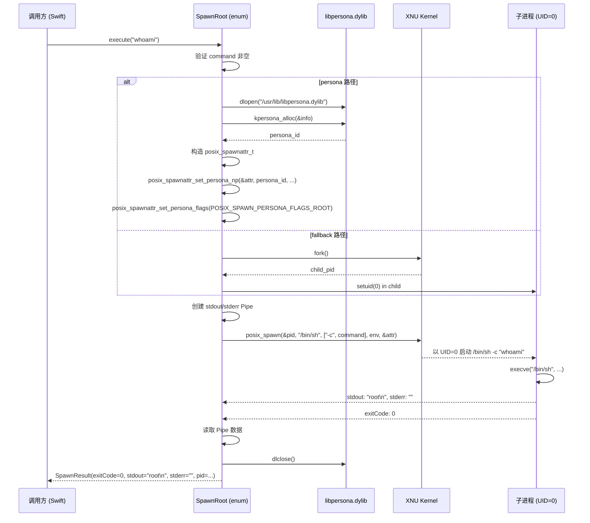
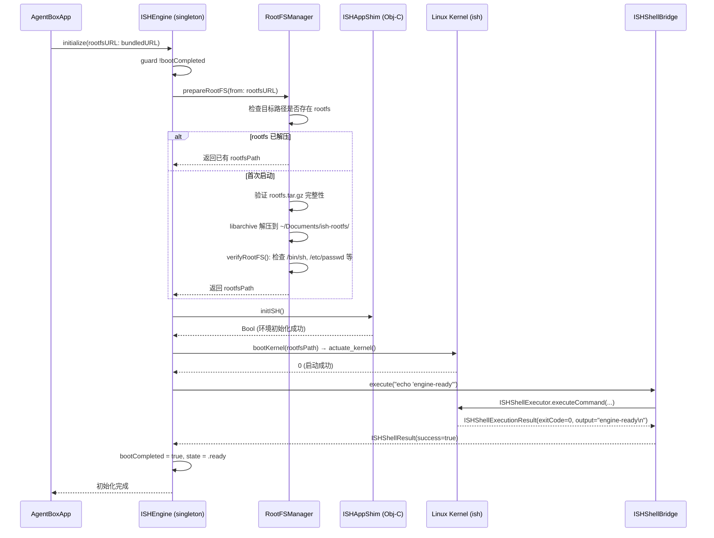
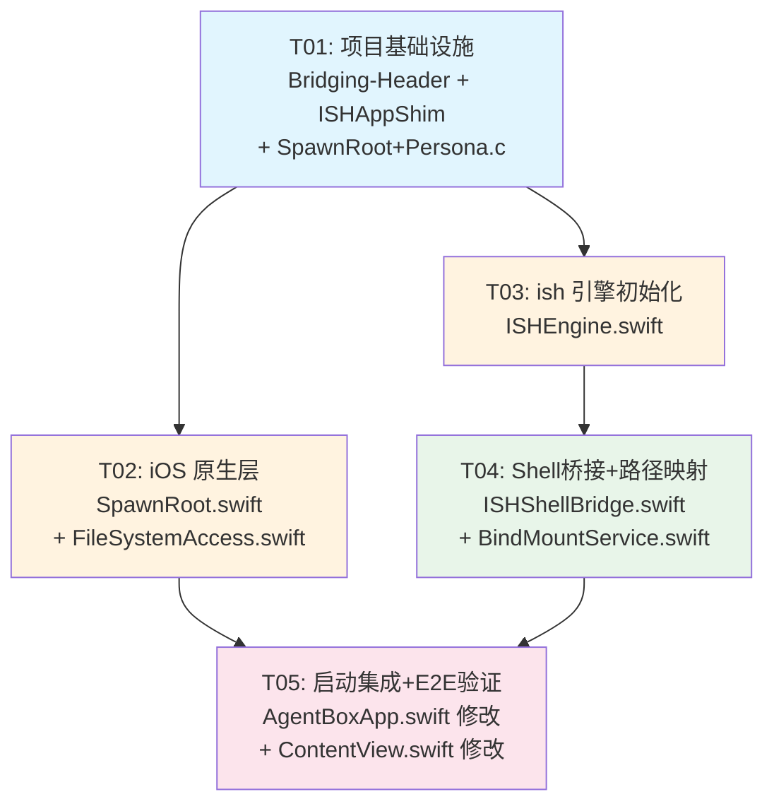

# AgentBox Phase 2 系统架构设计

| 属性 | 值 |
|------|-----|
| 版本 | 1.0 |
| 作者 | 高见远（Gao），Architect |
| 日期 | 2025-07-17 |
| 语言 | 中文 |
| 编程语言 | Swift 5.0 (iOS 16.0+) |
| 项目 | AgentBox Phase 2：TrollStore 集成 + ish 引擎初始化 |

---

## Part A：系统设计

### 1. 实现方案

#### 1.1 核心技术难点

| 难点 | 分析 | 方案 |
|------|------|------|
| **Root 权限执行** | iOS 17+ 已封杀 `posix_spawnattr_set_persona_np`，但目标系统 iOS 16.6.1 仍可用。需要 `persona-mgmt` entitlement + `libpersona.dylib` 未公开 API。 | 使用 `kpersona_alloc`/`kpersona_info` 结构创建 root persona，配合 `posix_spawnattr_set_persona_np` 以 UID=0 派生子进程。若 persona 不可用，回退到 `fork`+`setuid(0)`+`execve`。 |
| **无沙盒文件 IO** | iOS 沙盒限制 App 只能访问自己的 Container。`no-sandbox` entitlement 解除了此限制，但 `FileManager` 某些路径仍可能被拒绝。 | 全部使用 POSIX C API（`open`/`read`/`write`/`unlink`/`mkdir`/`rename`/`opendir`/`readdir`）替代 Foundation `FileManager`，确保完全绕过沙盒检查。 |
| **ish 内核启动** | ish-arm64 的 `actuate_kernel()` 需要 rootfs 就位后才能调用，且启动后有异步初始化阶段。 | ISHEngine 采用状态机模式，在 rootfs 解压完成后通过 `linux_start_session` 回调确认内核就绪。 |
| **ISHShellExecutor 依赖** | 原版 ish 的 `ISHShellExecutor.m` 依赖 `AppDelegate.h` 的 `current` task 和 `ProcessExitedNotification`。我们需要在 SwiftUI App 中提供替代实现。 | 在 Bridging Header 中引入 ISHShellExecutor.h，在 Swift 层通过 `@_silgen_name` 桥接关键 C 函数，同时提供一个最小化的 Obj-C shim（`ISHAppShim.m`）替代 AppDelegate 依赖。 |
| **Bind Mount 动态挂载** | ish fakefs 的 bind mount 通常在 rootfs 初始化阶段配置。运行时动态挂载需要内核支持 `mount(2)` syscall 且 fakefs 层支持。 | 优先尝试通过 ISHShellBridge 在 guest 内执行 `mount --bind`。若 fakefs 不支持，则使用 `realfs` 的 `bind_mount` C API（在 ISHShellBridge 初始化时静态注册路径映射表）。 |

#### 1.2 框架与库选型

| 依赖 | 选型 | 理由 |
|------|------|------|
| UI 框架 | SwiftUI (原生) | iOS 16.0+ 原生支持，无需额外依赖 |
| 并发模型 | Swift Concurrency (async/await + Actor) | 纯 Swift 原生，编译时安全，无需 Combine/RxSwift |
| C 桥接 | Bridging Header + `@_silgen_name` | 链接 ish-arm64 的 `libish.a` 静态库，通过 Bridging Header 暴露 C API |
| 文件解压 | libarchive / zlib (系统自带) | iOS 自带 libarchive 和 zlib，用于解压 Alpine rootfs.tar.gz |
| 进程管理 | `posix_spawn` + `libpersona.dylib` | iOS 原生 API，通过 TrollStore entitlement 获取 root 权限 |
| 文件系统 | POSIX C API (`fcntl.h`/`unistd.h`/`dirent.h`) | 绕过 Foundation `FileManager` 的沙盒限制 |

#### 1.3 架构模式

采用 **分层 + 单例服务** 模式：

```
┌──────────────────────────────────────────────┐
│              SwiftUI App Layer                │
│  AgentBoxApp.swift → 启动时初始化 ISHEngine    │
└──────────────────────┬───────────────────────┘
                       │
┌──────────────────────┼───────────────────────┐
│              Core Service Layer               │
│  ┌─────────────┐ ┌──────────────┐            │
│  │ SpawnRoot   │ │FileSystemAcc.│  iOS 原生   │
│  └─────────────┘ └──────────────┘            │
│  ┌─────────────┐ ┌──────────────┐            │
│  │ ISHEngine   │ │ISHShellBridge│  ish 引擎   │
│  └─────────────┘ └──────────────┘            │
│  ┌─────────────────────────────┐             │
│  │    BindMountService         │  路径映射    │
│  └─────────────────────────────┘             │
└──────────────────────┬───────────────────────┘
                       │
┌──────────────────────┼───────────────────────┐
│              C/Obj-C Bridge Layer              │
│  libpersona.dylib | libish.a | POSIX APIs     │
└──────────────────────────────────────────────┘
```

**并发模型**：
- `ISHEngine`：`@MainActor class`（单例，UI 状态绑定）
- `ISHShellBridge`：`actor`（保证线程安全，支持多命令并发）
- `BindMountService`：`actor`（挂载表互斥访问）
- `SpawnRoot` / `FileSystemAccess`：`enum`（无状态，纯静态方法，可任意线程调用）

---

### 2. 文件列表

#### 2.1 新增文件

| 相对路径 | 用途 | 类型 |
|----------|------|------|
| `src/Core/TrollStore/SpawnRoot.swift` | Root 权限进程执行，POSIX spawn + persona | Swift |
| `src/Core/Utilities/FileSystemAccess.swift` | 无沙盒文件系统操作包装 | Swift |
| `src/Core/ISHBridge/ISHEngine.swift` | ish 引擎生命周期管理（rootfs 解压 + 内核启动） | Swift |
| `src/Core/ISHBridge/ISHShellBridge.swift` | ISHShellExecutor C API 的 Swift async 包装 | Swift |
| `src/Core/ISHBridge/BindMountService.swift` | iOS 主机路径 ↔ Linux guest 路径绑定挂载 | Swift |
| `src/Core/ISHBridge/ISHAppShim.m` | 最小 Obj-C shim，替代 ish AppDelegate 依赖 | Obj-C |
| `src/Core/ISHBridge/ISHAppShim.h` | ISHAppShim 头文件 | Obj-C |
| `src/Core/Utilities/SpawnRoot+Persona.c` | Persona 管理的 C 实现（kpersona_alloc/dealloc） | C |

#### 2.2 修改文件

| 相对路径 | 修改内容 |
|----------|----------|
| `src/Resources/AgentBox-Bridging-Header.h` | 添加 ish-arm64 C 头文件引用 + ISHAppShim.h |
| `src/App/AgentBoxApp.swift` | 添加启动时 ISHEngine 初始化逻辑 |
| `src/App/ContentView.swift` | Terminal tab 接入 ISHShellBridge 演示（可选，P2） |

#### 2.3 不修改文件

| 相对路径 | 说明 |
|----------|------|
| `src/Entitlements.plist` | **已包含所需三个 entitlement**，无需修改 |
| `src/Resources/Info.plist` | 无需修改 |
| `src/Models/Data/Models.swift` | Phase 2 不涉及持久化模型变更 |
| `src/Models/Settings/RuntimeModels.swift` | 已有 `ShellOutput` 等类型，无需修改 |
| `src/Models/Settings/HarnessModels.swift` | 已有检查点/权限/度量模型，无需修改 |

---

### 3. 数据结构和接口

```mermaid
classDiagram
    direction TB

    %% ======== SpawnRoot 模块 ========
    class SpawnRoot {
        &lt;&lt;enum&gt;&gt;
        +execute(_ command: String, environment: [String: String]?) throws SpawnResult$
        +execute(executable: String, arguments: [String], environment: [String: String]?) throws SpawnResult$
        -createPersona() throws Int32$
        -setupPipes() (Pipe, Pipe)$
    }

    class SpawnResult {
        +exitCode: Int32
        +stdout: Data
        +stderr: Data
        +pid: pid_t
    }

    class SpawnError {
        &lt;&lt;enum&gt;&gt;
        spawnFailed(errno: Int32)
        personaFailed(reason: String)
        pipeError
        commandEmpty
    }

    SpawnRoot ..> SpawnResult : returns
    SpawnRoot ..> SpawnError : throws

    %% ======== FileSystemAccess 模块 ========
    class FileSystemAccess {
        &lt;&lt;enum&gt;&gt;
        +readFile(at: String) throws Data$
        +writeFile(at: String, data: Data, createIntermediate: Bool) throws$
        +deleteFile(at: String) throws$
        +fileExists(at: String) Bool$
        +isDirectory(at: String) Bool$
        +createDirectory(at: String, withIntermediate: Bool) throws$
        +listDirectory(at: String) throws [String]$
        +deleteDirectory(at: String) throws$
        +moveFile(from: String, to: String) throws$
        +copyFile(from: String, to: String) throws$
        +attributes(at: String) throws FileAttributes$
        -posixOpen(path: String, flags: Int32, mode: mode_t) Int32$
        -findExecutable(named: String) String?$
        -fileExistsPOSIX(at: String) Bool$
    }

    class FileAttributes {
        +size: Int64
        +modificationDate: Date
        +creationDate: Date
        +isDirectory: Bool
        +permissions: Int16
    }

    FileSystemAccess ..> FileAttributes : returns

    %% ======== ISHEngine 模块 ========
    class ISHEngine {
        &lt;&lt;class&gt;&gt;
        +shared: ISHEngine$
        +isInitialized: Bool
        +state: EngineState
        +initialize(rootfsURL: URL) throws$
        +rootfsPath: String
        -bootCompleted: Bool
        -startISHKernel(rootPath: String) Int32
        -validateEngine() throws
    }

    class EngineState {
        &lt;&lt;enum&gt;&gt;
        uninitialized
        extracting
        booting
        ready
        error(String)
    }

    class EngineError {
        &lt;&lt;enum&gt;&gt;
        rootfsNotFound
        rootfsCorrupted(reason: String)
        extractionFailed(underlying: Error)
        kernelBootFailed(reason: String)
        alreadyInitialized
        notInitialized
        diskSpaceInsufficient(available: Int64, needed: Int64)
    }

    class RootFSManager {
        &lt;&lt;class&gt;&gt;
        +prepareRootFS(from: URL) throws String
        -extractTarGz(at: URL, to: String) throws
        -verifyRootFS(at: String) throws
        +rootfsExists(at: String) Bool
        +cleanupRootFS(at: String) throws
    }

    ISHEngine *-- EngineState
    ISHEngine ..> EngineError : throws
    ISHEngine *-- RootFSManager

    %% ======== ISHShellBridge 模块 ========
    class ISHShellBridge {
        &lt;&lt;class&gt;&gt;
        +shared: ISHShellBridge$
        +execute(_ command: String, lineCallback: Closure?) async throws ISHShellResult
        +execute(executable: String, arguments: [String], environment: [String: String]?, lineCallback: Closure?) async throws ISHShellResult
        +executeSync(_ command: String, timeout: TimeInterval, lineCallback: Closure?) ISHShellResult
        +kill(pid: Int32, signal: Int32) Bool
        -activeProcesses: [Int32: ProcessHandle]
    }

    class ISHShellResult {
        +exitCode: Int32
        +pid: Int32
        +stdout: String
        +stderr: String
        +duration: TimeInterval
        +success: Bool
    }

    class ISHShellError {
        &lt;&lt;enum&gt;&gt;
        engineNotInitialized
        processCreationFailed
        execFailed(reason: String)
        timeout
        cancelled
        unknown(Int32)
    }

    ISHShellBridge ..> ISHShellResult : returns
    ISHShellBridge ..> ISHShellError : throws
    ISHShellBridge --> ISHEngine : depends on

    %% ======== BindMountService 模块 ========
    class BindMountService {
        &lt;&lt;class&gt;&gt;
        +shared: BindMountService$
        +mounts: [BindMount]
        +mount(hostPath: String, guestPath: String, isReadOnly: Bool) throws
        +unmount(guestPath: String) throws
        +unmountAll() throws
        -activeMounts: [UUID: BindMount]
    }

    class BindMount {
        +id: UUID
        +hostPath: String
        +guestPath: String
        +isReadOnly: Bool
        +createdAt: Date
    }

    class MountError {
        &lt;&lt;enum&gt;&gt;
        hostPathNotFound
        guestPathInaccessible
        alreadyMounted(existing: BindMount)
        notMounted(guestPath: String)
        engineNotInitialized
        mountSyscallFailed(errno: Int32)
    }

    BindMountService *-- BindMount
    BindMountService ..> MountError : throws
    BindMountService --> ISHEngine : depends on
    BindMountService --> ISHShellBridge : uses for mount cmd

    %% ======== C Bridge ========
    class ISHAppShim {
        &lt;&lt;Obj-C&gt;&gt;
        +current: ISHAppShim$
        +initISH() Bool
        +bootKernel(rootPath: NSString) Int32
        +bootCompleted: Bool
    }
```



---

### 4. 程序调用流程

#### 4.1 SpawnRoot 执行流程



#### 4.2 引擎初始化流程



---

### 5. 待明确事项

| # | 问题 | 影响范围 | 当前假设 |
|---|------|---------|----------|
| Q1 | **`posix_spawnattr_set_persona_np` 在 iOS 16.6.1 是否可用？** | SpawnRoot | **假设可用**（TrollStore DeepWiki 确认）。若不可用，方案 B：`fork` + `setuid(0)` + `execve`。代码中同时实现两条路径，优先 persona，失败回退。 |
| Q2 | **`actuate_kernel()` 是同步还是异步？** | ISHEngine | **假设同步**（调用后内核已启动）。但 shell executor 可能需要等待 `linux_start_session` 回调。设计中通过 `echo 'engine-ready'` 验证就绪，而非仅依赖 `actuate_kernel()` 返回值。 |
| Q3 | **rootfs 解压目标路径？** | ISHEngine | **假设解压到 App Container 内**：`~/Documents/ish-rootfs/`。不放到共享路径避免权限/迁移复杂性。路径可配置。 |
| Q4 | **ISHShellExecutor 如何适配 SwiftUI App？** | ISHShellBridge | **假设需要最小 Obj-C shim**（`ISHAppShim.m`），提供 `current` 单例 + 内核启动桥接。`ProcessExitedNotification` 由 ISHShellBridge 内部管理。 |
| Q5 | **Bind mount 是否支持运行时动态挂载？** | BindMountService | **假设优先使用 guest 内 `mount --bind`**（在 ISHShellBridge 执行）。若 fakefs 不支持，需通过 `realfs` C API 静态注册。Phase 2 先实现动态 mount 路径，失败时回退到初始化时静态注册。 |
| Q6 | **多进程并发安全？** | ISHShellBridge | **假设 ISHShellExecutor 非线程安全**。采用 `actor` 隔离，内部维护 `activeProcesses` 字典逐命令追踪。多命令串行化（P1-2 多命令并行为 Phase 3 需求）。 |
| Q7 | **SpawnRoot 和 ISHShellBridge 的执行环境区别？** | 文档 | SpawnRoot 在 **iOS 原生环境**执行（/bin/sh on Darwin），ISHShellBridge 在 **Linux guest** 执行（/bin/sh on Alpine Linux）。路径空间不同，调用方必须明确选择。设计文档和 API 注释中明确标注。 |

---

## Part B：任务分解

### 6. 依赖包列表

本项目为纯 Swift/iOS 原生开发，**无需任何第三方包**。所有能力来自：

```
# 系统框架（无需安装）
- SwiftUI                    # UI 框架
- Foundation                 # 基础类型 + FileManager
- libarchive.tbd             # tar.gz 解压（iOS 自带）
- libz.tbd                   # gzip 解压（iOS 自带）

# 系统动态库（dlopen 加载）
- /usr/lib/libpersona.dylib  # persona 管理（iOS 自带）

# C 静态库（需在 Xcode 项目中链接）
- libish.a                   # ish-arm64 编译产物（外部构建）
```

### 7. 任务列表（按依赖顺序）

| 任务 ID | 任务名称 | 源文件 | 依赖 | 优先级 |
|---------|----------|--------|------|--------|
| T01 | 项目基础设施 | `src/Resources/AgentBox-Bridging-Header.h`（改）、`src/Core/ISHBridge/ISHAppShim.h`（新）、`src/Core/ISHBridge/ISHAppShim.m`（新）、`src/Core/Utilities/SpawnRoot+Persona.c`（新） | 无 | P0 |
| T02 | iOS 原生层：SpawnRoot + FileSystemAccess | `src/Core/TrollStore/SpawnRoot.swift`（新）、`src/Core/Utilities/FileSystemAccess.swift`（新） | T01 | P0 |
| T03 | ish 引擎初始化：ISHEngine | `src/Core/ISHBridge/ISHEngine.swift`（新） | T01 | P0 |
| T04 | Shell 桥接 + 路径映射 | `src/Core/ISHBridge/ISHShellBridge.swift`（新）、`src/Core/ISHBridge/BindMountService.swift`（新） | T03 | P0 |
| T05 | 启动集成 + 端到端验证 | `src/App/AgentBoxApp.swift`（改）、`src/App/ContentView.swift`（改） | T02, T04 | P0 |

#### T01 — 项目基础设施

**描述**：建立 C/Obj-C 桥接层，使 Swift 代码能调用 ish-arm64 C API 和 persona 管理函数。

**源文件**：
- `src/Resources/AgentBox-Bridging-Header.h`（修改）— 添加所有必要的 ish-arm64 C 头文件引用
- `src/Core/ISHBridge/ISHAppShim.h`（新增）— Obj-C shim 类声明，替代 ish AppDelegate
- `src/Core/ISHBridge/ISHAppShim.m`（新增）— Obj-C shim 实现：单例 `current`、`initISH()`、`bootKernel()` 桥接
- `src/Core/Utilities/SpawnRoot+Persona.c`（新增）— 纯 C 实现：`kpersona_alloc`/`kpersona_dealloc`/`posix_spawnattr_set_persona_np` 包装

**关键实现点**：
1. Bridging Header 中引入（按需，不引入不会被 Swift 调用的内部头文件）：
   ```objc
   // ish 关键头文件
   #import "ISHShellExecutor.h"   // Shell 执行器
   #import "kernel/init.h"        // actuate_kernel()
   #include "fs/real.h"           // realfs bind mount
   ```
2. ISHAppShim.m 提供最小 AppDelegate 替代：
   - `+ (instancetype)current` 单例
   - `- (BOOL)initISH` 初始化 ish 环境（非 AppDelegate 依赖部分）
   - `- (int)bootKernel:(NSString *)rootPath` 调用 `actuate_kernel()`
3. SpawnRoot+Persona.c 封装：
   - `int agentbox_persona_alloc_root(void)` — 分配 root persona
   - `void agentbox_persona_dealloc(int persona_id)` — 释放
   - `int agentbox_spawn_with_persona(const char *cmd, ...)` — 完整 spawn 流程

**产出物**：编译可通过的桥接层，C 函数可被 Swift 调用。

---

#### T02 — iOS 原生层：SpawnRoot + FileSystemAccess

**描述**：实现两个不依赖 ish 引擎的基础服务——以 root 权限执行 iOS 原生命令，以及无沙盒文件系统操作。

**源文件**：
- `src/Core/TrollStore/SpawnRoot.swift`（新增）— `SpawnRoot` enum + `SpawnResult` + `SpawnError`
- `src/Core/Utilities/FileSystemAccess.swift`（新增）— `FileSystemAccess` enum + `FileAttributes`

**SpawnRoot 关键实现点**：
1. `execute(_ command:)` — shell 命令路径，内部调 `/bin/sh -c`
2. `execute(executable:arguments:environment:)` — 直接可执行文件路径
3. Persona 管理：调用 T01 的 C 函数 `agentbox_persona_alloc_root()` + `agentbox_spawn_with_persona()`
4. Fallback 路径：若 persona 失败，走 `fork` + `setuid(0)` + `execve`
5. Pipe 管理：stdout/stderr 分别捕获，避免死锁（使用 `DispatchIO` 或非阻塞读取）
6. 超时控制：默认无超时，可选 `timeout: TimeInterval` 参数

**FileSystemAccess 关键实现点**：
1. **全部使用 POSIX C API**（`open`/`read`/`write`/`close`/`unlink`/`mkdir`/`rename`/`opendir`/`readdir`/`stat`/`lstat`/`fstat`），不经过 `FileManager`
2. `readFile` → `open(O_RDONLY)` + `read` 循环
3. `writeFile` → `open(O_WRONLY|O_CREAT|O_TRUNC, mode)` + `write`
4. `createDirectory` → `mkdir(path, 0755)` + 可选 `withIntermediate: true`（递归创建父目录）
5. `listDirectory` → `opendir` + `readdir` 循环
6. `attributes` → `stat`/`lstat` 转换为 `FileAttributes`
7. `moveFile` → `rename`
8. `copyFile` → `open(src)` + `open(dst, O_CREAT|O_WRONLY)` + `sendfile`/`read+write` 循环

**产出物**：两个模块可独立编译、单独测试。里程碑 M1 完成。

---

#### T03 — ish 引擎初始化：ISHEngine

**描述**：实现 ish Linux 引擎的完整初始化流程——rootfs 解压验证 → 内核启动 → 就绪验证。

**源文件**：
- `src/Core/ISHBridge/ISHEngine.swift`（新增）— `ISHEngine` class + `RootFSManager` + `EngineState` + `EngineError`

**关键实现点**：
1. **单例模式**：`static let shared = ISHEngine()`，全局唯一内核实例
2. **状态机**：`EngineState` 枚举驱动初始化流程
   ```
   uninitialized → extracting → booting → ready
                                       ↘ error(String)
   ```
3. **RootFSManager**：
   - 解压目标：`~/Documents/ish-rootfs/`（`FileManager.default.urls(for: .documentDirectory, ...)`）
   - 解压工具：使用系统 `libarchive` API（`archive_read_new`/`archive_read_support_filter_gzip`/`archive_read_support_format_tar`）
   - 完整性验证：解压后检查关键文件存在（`/bin/sh`、`/etc/passwd`、`/etc/alpine-release`）
   - 幂等：若目标路径已存在有效 rootfs，跳过解压
4. **内核启动**：
   - 调用 T01 的 `ISHAppShim.initISH()` → `ISHAppShim.bootKernel(rootPath)`
   - `bootKernel` 内部调用 ish C API `actuate_kernel()`
5. **就绪验证**：
   - 内核启动后，通过 ISHShellBridge 执行 `echo 'engine-ready'`
   - 验证 exitCode==0 且 output 包含 "engine-ready"
6. **错误处理**：
   - `rootfsNotFound`：捆绑的 rootfs.tar.gz 缺失
   - `rootfsCorrupted`：解压后关键文件缺失
   - `extractionFailed`：libarchive 解压错误
   - `kernelBootFailed`：`actuate_kernel()` 返回非 0
   - `diskSpaceInsufficient`：磁盘空间不足

**产出物**：ISHEngine 可独立编译。里程碑 M2 完成。

---

#### T04 — Shell 桥接 + 路径映射

**描述**：实现 ISHShellExecutor C API 的 Swift async 包装，以及 iOS 主机路径 ↔ Linux guest 路径的绑定挂载服务。

**源文件**：
- `src/Core/ISHBridge/ISHShellBridge.swift`（新增）— `ISHShellBridge` class + `ISHShellResult` + `ISHShellError`
- `src/Core/ISHBridge/BindMountService.swift`（新增）— `BindMountService` class + `BindMount` + `MountError`

**ISHShellBridge 关键实现点**：
1. **异步执行**（`execute` async/await）：
   - 使用 `withCheckedContinuation` 桥接 ISHShellExecutor 的回调模式
   - 确保 `ISHEngine.shared.isInitialized == true`，否则 throw `engineNotInitialized`
2. **同步执行**（`executeSync`）：
   - 使用 `DispatchSemaphore` 阻塞等待，带 `timeout` 参数
   - 超时时 throw `timeout`
3. **行回调**（`lineCallback`）：
   - ISHShellExecutor 的行回调在任意线程，需 dispatch 到主队列
   - 回调参数：`(line: String, isStderr: Bool)`
4. **进程终止**（`kill`）：
   - 封装 `ISHShellExecutor.killProcess(pid, signal)`
   - 同时清理 `activeProcesses` 记录
5. **错误映射**：
   - `ISHShellExecutorError` → `ISHShellError` 枚举

**BindMountService 关键实现点**：
1. **挂载**（`mount`）：
   - 先在 guest 内确保挂载点目录存在：`mkdir -p <guestPath>`
   - 执行 `mount --bind <hostPath> <guestPath>`（通过 ISHShellBridge）
   - 若 `mount --bind` 在 fakefs 中不可用，回退到 `realfs` C API
2. **卸载**（`unmount`）：
   - 在 guest 内执行 `umount <guestPath>`
3. **挂载表维护**：
   - `activeMounts: [UUID: BindMount]`，actor 保护互斥访问
4. **验证**：
   - 挂载后通过 `ls <guestPath>` 验证挂载点可访问
   - 卸载后确认路径不可访问

**产出物**：ISHShellBridge + BindMountService 可独立编译。里程碑 M3 完成。

---

#### T05 — 启动集成 + 端到端验证

**描述**：在 App 入口集成引擎初始化，提供端到端验证逻辑，确保所有模块正确协同工作。

**源文件**：
- `src/App/AgentBoxApp.swift`（修改）— 启动时初始化 ISHEngine
- `src/App/ContentView.swift`（修改）— Terminal tab 展示引擎状态

**AgnetBoxApp.swift 修改**：
```swift
@main
struct AgentBoxApp: App {
    @StateObject private var engine = ISHEngine.shared
    
    var body: some Scene {
        WindowGroup {
            ContentView()
                .environmentObject(engine)
                .task {
                    guard let rootfsURL = Bundle.main.url(forResource: "alpine-aarch64", withExtension: "tar.gz") else {
                        print("[AgentBox] rootfs 未找到，跳过引擎初始化")
                        return
                    }
                    do {
                        try await engine.initialize(rootfsURL: rootfsURL)
                    } catch {
                        print("[AgentBox] 引擎初始化失败: \(error)")
                    }
                }
        }
    }
}
```

**ContentView.swift 修改**：
- Terminal 占位视图改为展示 ISHEngine 状态
- 若引擎就绪，显示 "Engine Ready" + 简单输入框（可选，用于手动验证）

**端到端验证清单**：
1. App 启动 → ISHEngine 自动初始化
2. SpawnRoot 独立验证：`SpawnRoot.execute("whoami")` → stdout="root"
3. FileSystemAccess 独立验证：`FileSystemAccess.writeFile(at: "/tmp/ab-test", data: ...)` 成功
4. ISHEngine 初始化验证：`engine.isInitialized == true`
5. ISHShellBridge 验证：`bridge.execute("echo hello")` → exitCode=0, stdout="hello"
6. BindMountService 验证：mount → guest 内 ls → 卸载
7. 综合验证：`echo "test" > /tmp/test.txt` 在 guest 中执行，`cat /tmp/test.txt` 输出 "test"

**产出物**：完整可运行的 Phase 2 交付物。里程碑 M4 完成。

---

### 8. 共享知识（跨文件约定）

#### 8.1 错误处理模式

```swift
// 所有抛出错误的模块遵循统一模式：
// 1. 定义模块专属 Error 枚举（带关联值，提供诊断信息）
// 2. 公开 API 标记 throws
// 3. 内部 POSIX 错误 → errno 转换为枚举 case
// 4. 错误信息使用中文描述

// 示例：POSIX errno 转换
private static func posixError(_ err: Int32) -> FileSystemError {
    switch err {
    case ENOENT: return .fileNotFound
    case EACCES: return .permissionDenied
    case ENOSPC: return .diskFull
    default:     return .systemError(errno: err)
    }
}
```

#### 8.2 并发模型

| 类型 | 并发策略 | 理由 |
|------|----------|------|
| `enum`（SpawnRoot, FileSystemAccess） | 无状态，任意线程安全 | 纯静态方法 |
| `class` + 单例（ISHEngine） | `@MainActor`，状态变更在主线程 | SwiftUI `@Published` 绑定 |
| `class`（ISHShellBridge, BindMountService） | `actor` | 互斥访问内部状态，串行化命令执行 |
| C 函数（Persona, Boot） | 同步阻塞，调用方负责线程调度 | C 层不感知 Swift Concurrency |

#### 8.3 单例 vs 实例

| 模块 | 模式 | 理由 |
|------|------|------|
| `ISHEngine` | **单例** `static let shared` | 全局唯一 Linux 内核实例，不可重复启动 |
| `ISHShellBridge` | **实例**（但提供 `shared` 便利访问） | 内核单例决定桥接器也只需一个，但保留实例化能力用于测试 |
| `BindMountService` | **单例** `static let shared` | 全局唯一挂载表 |
| `SpawnRoot` | **enum（无实例）** | 纯工具函数，无状态 |
| `FileSystemAccess` | **enum（无实例）** | 纯工具函数，无状态 |

#### 8.4 路径约定

```
iOS 原生路径（SpawnRoot, FileSystemAccess）：
  /var/mobile/Documents/    — 用户文档
  /tmp/                     — 临时目录
  /var/root/                — root 用户 home

Linux guest 路径（ISHShellBridge, BindMountService）：
  /root/                    — root 用户 home
  /tmp/                     — guest 临时目录
  /mnt/                     — bind mount 挂载点根
```

#### 8.5 命名约定

- Swift 文件：PascalCase，与主类型名一致（`SpawnRoot.swift`）
- C/Obj-C 文件：与 Swift 模块有关的加 `AgentBox` 或 `ISH` 前缀
- 私有方法：`private static func`（enum）或 `private func`（class/actor）
- C 桥接函数：`agentbox_` 前缀（避免与 ish 内部符号冲突）

#### 8.6 日志约定

```swift
// 统一使用 print + 模块前缀（后续 Phase 接入 Logger 单例）
print("[SpawnRoot] 执行命令: \(command)")
print("[ISHEngine] 状态变更: \(state)")
print("[ISHShellBridge] 命令完成: exitCode=\(result.exitCode), 耗时=\(result.duration)s")
```

#### 8.7 数据格式

- 时间：Unix timestamp (`TimeInterval` since 1970) 或 `ISO 8601`（持久化场景）
- 文件大小：`Int64`（支持 >4GB 文件）
- PID：`pid_t`（iOS）/ `Int32`（guest），互不混淆
- 路径：全部使用绝对路径字符串，不使用 `file://` URL

---

### 9. 任务依赖图



**说明**：
- T01 是所有模块的前置依赖（Bridging Header + C shim）
- T02（SpawnRoot + FileSystemAccess）和 T03（ISHEngine）可并行开发，仅依赖 T01
- T04 依赖 T03（ISHShellBridge 需要内核已启动）
- T05 依赖 T02 和 T04，做最终集成验证

---

*本文档由 Gao (Architect) 产出，通过 SendMessage 回传主理人。*
